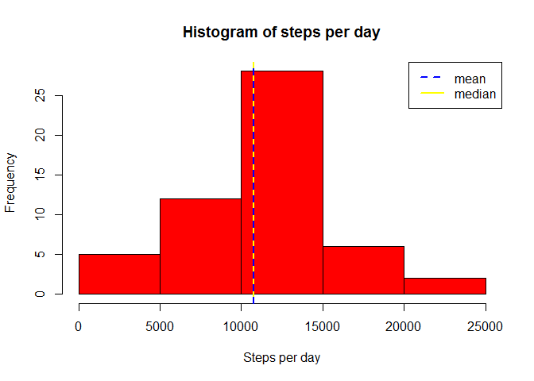
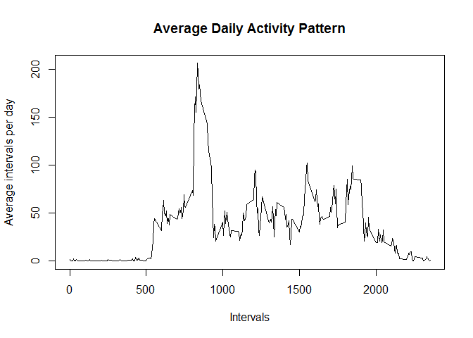
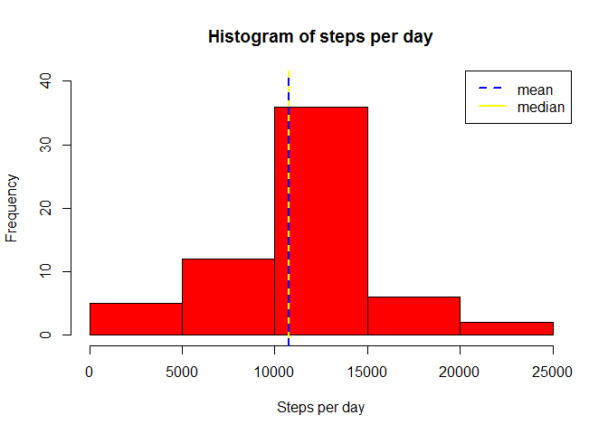
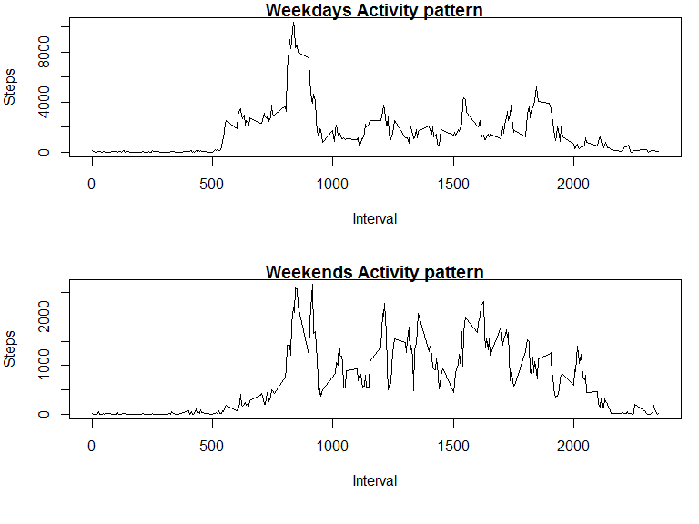

## Loading and preprocessing the data

### Reading the data

```r
if(!file.exists("activity.csv")){
  unzip("activity.zip")
  
}

data <- read.csv("activity.csv")
head(data)
```

```
##   steps       date interval
## 1    NA 2012-10-01        0
## 2    NA 2012-10-01        5
## 3    NA 2012-10-01       10
## 4    NA 2012-10-01       15
## 5    NA 2012-10-01       20
## 6    NA 2012-10-01       25
```

### Processing the data

```r
# Converting date column to date class
data$date <- as.Date(as.character(data$date),"%Y-%m-%d")

# Creating column for week days
data$day_of_week <- weekdays(data$date,abbreviate = TRUE)

# Displaying few lines of processed data
head(data)
```

```
##   steps       date interval day_of_week
## 1    NA 2012-10-01        0         Mon
## 2    NA 2012-10-01        5         Mon
## 3    NA 2012-10-01       10         Mon
## 4    NA 2012-10-01       15         Mon
## 5    NA 2012-10-01       20         Mon
## 6    NA 2012-10-01       25         Mon
```

## What is mean total number of steps taken per day?


```r
# Aggregation on the basis of date with sum function
sum_steps <- aggregate(steps~date,data,sum,na.rm=TRUE)

# Plotting the data using histogram
hist(sum_steps$steps,
     col = "red",
     xlab="Steps per day",
     main="Histogram of steps per day")

# Reference line for median
abline(v=median(sum_steps$steps,na.rm = TRUE),
       col="yellow",
       lwd=2)

# Reference line for mean
abline(v=mean(sum_steps$steps,na.rm=TRUE),
       col="blue",
       lwd=2,
       lty=2)

# Defining legend
legend("topright",
       legend = c("mean","median"),
       lty=c(2,1),
       lwd = c(2,2),
       col = c("blue","yellow"))
```

<!-- -->

mean


```r
# Calculating and Displaying mean 
mean(sum_steps$steps)
```

```
## [1] 10766.19
```

median


```r
# Calculating and Displaying median
median(sum_steps$steps)
```

```
## [1] 10765
```


## What is the average daily activity pattern?


```r
# Aggregation on the basis of intervals and applying mean function on groups
average_interval <- aggregate(steps~interval,data,mean,na.rm=TRUE)

# plooting the data
plot(average_interval$interval,
     average_interval$steps,
     type="l",
     xlab = "Intervals",
     ylab = "Average intervals per day",
     main = "Average Daily Activity Pattern")
```

<!-- -->


## Imputing missing values


```r
# importing required libraries
library(dplyr)
```

```
## Warning: package 'dplyr' was built under R version 3.6.3
```

```
## 
## Attaching package: 'dplyr'
```

```
## The following objects are masked from 'package:stats':
## 
##     filter, lag
```

```
## The following objects are masked from 'package:base':
## 
##     intersect, setdiff, setequal, union
```

```r
# subsetting data with NA values
data_new <- subset(data,is.na(data$steps))

# imputing mean of individual intervals to missing data
for(x in 1:nrow(data_new)){
  data_new$steps[x] <- average_interval$steps[average_interval$interval==
                                  data_new$interval[x]]
}

# subsetting data without NA values
data_old <- subset(data,!is.na(data$steps))

# Row binding data_old and data_new using rbind
final_data <- rbind(data_old,data_new)

# Sorting final_data on the basis of groups
final_data <- arrange(final_data,by_group=date)

# Displaying few rows of final_data
head(final_data)
```

```
##       steps       date interval day_of_week
## 1 1.7169811 2012-10-01        0         Mon
## 2 0.3396226 2012-10-01        5         Mon
## 3 0.1320755 2012-10-01       10         Mon
## 4 0.1509434 2012-10-01       15         Mon
## 5 0.0754717 2012-10-01       20         Mon
## 6 2.0943396 2012-10-01       25         Mon
```


```r
# Aggregation of final data based on date groups and applying sum function
sum_final_data <- aggregate(steps~date,final_data,sum)

# Plotting the histogram
hist(sum_final_data$steps,
     col = "red",
     ylim = c(0,40),
     xlab="Steps per day",
     main="Histogram of steps per day")

# Reference line for median
abline(v=median(sum_final_data$steps,na.rm = TRUE),
       col="yellow",
       lwd=2)

# Reference line for mean
abline(v=mean(sum_final_data$steps,na.rm=TRUE),
       col="blue",
       lwd=2,
       lty=2)

# Defining Legends
legend("topright",
       legend = c("mean","median"),
       lty=c(2,1),
       lwd = c(2,2),
       col = c("blue","yellow"))
```

<!-- -->

Mean


```r
# Calculating and Displaying Mean
mean(sum_final_data$steps)
```

```
## [1] 10766.19
```

Median

```r
# Calculating and Displaying Median
median(sum_final_data$steps)
```

```
## [1] 10766.19
```

## Are there differences in activity patterns between weekdays and weekends?

Subsetting weekdays

```r
# Subsetting data for weekdays
data_weekday <- subset(final_data,day_of_week 
                       %in% c("Mon","Tue","Wed","Thu","Fri"))

# Displaying few rows of weekdays data
head(data_weekday)
```

```
##       steps       date interval day_of_week
## 1 1.7169811 2012-10-01        0         Mon
## 2 0.3396226 2012-10-01        5         Mon
## 3 0.1320755 2012-10-01       10         Mon
## 4 0.1509434 2012-10-01       15         Mon
## 5 0.0754717 2012-10-01       20         Mon
## 6 2.0943396 2012-10-01       25         Mon
```

Subsetting weekend rows

```r
# Subsetting data for weekends
data_weekends <- subset(final_data,day_of_week %in% c("Sat","Sun"))

# Displaying few rows of weekends data
head(data_weekends)
```

```
##      steps       date interval day_of_week
## 1441     0 2012-10-06        0         Sat
## 1442     0 2012-10-06        5         Sat
## 1443     0 2012-10-06       10         Sat
## 1444     0 2012-10-06       15         Sat
## 1445     0 2012-10-06       20         Sat
## 1446     0 2012-10-06       25         Sat
```

Final data Processing

```r
# Weekdays data
# Grouping on the basis of interval and sum aggregation
final_weekdays <- aggregate(steps~interval,data_weekday,sum)

# Weekends data
# Grouping on the basis of interval and sum aggregation
final_weekends <- aggregate(steps~interval,data_weekends,sum)
```


```r
# Plotting graph
# Creation of two panels
par(mfcol=c(2,1),mar=c(6,4,1,1))

# Plotting Weekdays data in Panel 1
plot(final_weekdays$interval,
     final_weekdays$steps,
     type="l",
     xlab="Interval",
     ylab="Steps",
     main="Weekdays Activity pattern")

# Plotting Weekends data in Panel 2
plot(final_weekends$interval,
     final_weekends$steps,
     type = "l",
     xlab="Interval",
     ylab="Steps",
     main = "Weekends Activity pattern")
```

<!-- -->

